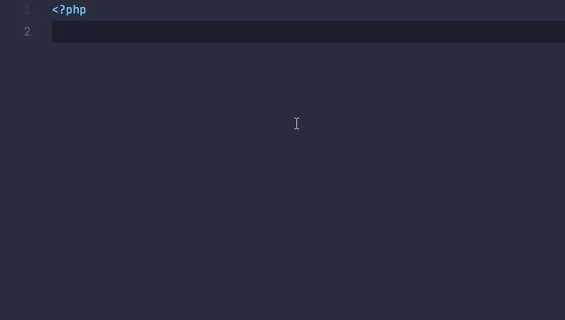

# Elementor Snippets by Themexplosion

This VSCode extension is targeted for WordPress developers who builds websites and create custom Elementor Widgets.

## Features

Here is a visual example showing how this extension works -

Here is a list of elementor widgets that this plugin contains.

| Name of control    | Trigger |
| ------------------ | :-------: |
| Starting Elementor section in content tab |    elsec    |
| Starting Elementor section in style tab   |   elsecs   |
| Elementor TEXT control            |    eltext     |
| Elementor NUMBER control          |    elnumber     |
| Elementor TEXTAREA control        |    eltextarea   |
| Elementor WYSIWYG control        |    elwysiwyg   |
| Elementor CODE control        |    elcode   |
| Elementor SWITCHER control       |    elswitcher   |
| Elementor COLOR control       |    elcolor   |
| Elementor HEADING control       |    elheading   |
| Elementor CHOOSE control      |    elchoose   |
| Elementor FONT control      |    elfont   |
| Elementor DATE_TIME control     |    eldatetime   |
| Elementor REPEATER control     |    elrepeater   |
| Elementor SELECT control    |    elselect   |
| Elementor URL Control    |    elurl   |
| Elementor MEDIA control    |    elmedia   |
| Elementor Tabs control    |    eltabs   |
| Elementor Background control    |    elbackground   |
| Elementor Icon control    |    elicon   |
| Elementor Icon render    |    el_icon_render   |
| Elementor Typography Control  |    eltypography   |
| Elementor Divider Control  |    eldivider   |
| Elementor Border Control  |    elborder   |
| Elementor Control Condition  |    elcondition   |
| Elementor Dimension Control  |    eldimension   |

## Contribution

If you find any bugs or have any issues/ features suggestions, you can add your issues in the public github repository. We will be happy to integrate your contribution via pull request.

https://github.com/themexplosion/vscode-elementor-snippets

## Release Notes

Users appreciate release notes as you update your extension.

### 1.0.0

Initial release.
